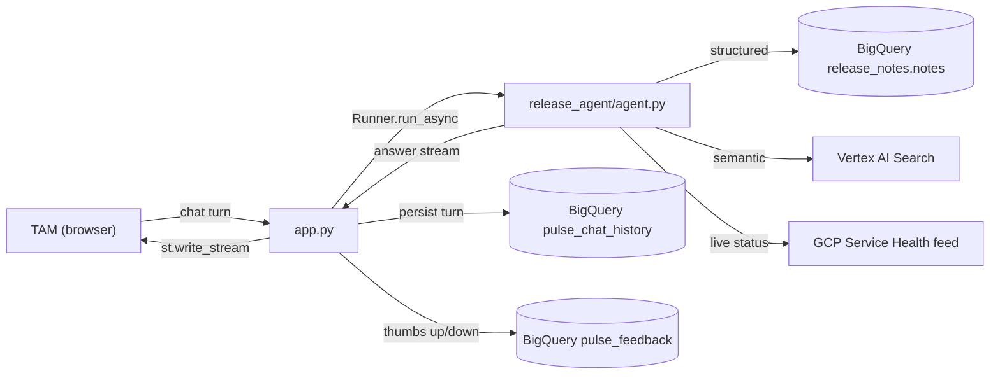

# Cloud Comms
AI-powered Product Synthesizer that automatically ingests and processes public Google Cloud documentation and public health service announcements for Google Technical Account Managers. 
---

### **Team Members**

| Name             | GitHub Handle | Contribution                                                             |
|------------------|---------------|--------------------------------------------------------------------------|
| Jeslyn Chang    | @se1yu | Backend integration for Vertex AI + BigQuery, coded Streamlit integration based off team mocks, and debugging IAM        |
| Leslie Tejeda Peña | @LTejeda2006     |Front-end implementation, worked on team mocks using HTML, JavaScript, and CSS, and real life UX Iteration & Polish|
| Brianna Ikwuemesi    | @xCBriannaI  |Designed UX UI using figma, translated wireframes into an interactive web application, bridged product design and engineering for best user experience|
| Purnoor Sharma     | @noorps     | Data Engineering + Retrieval for BigQuery, integrating Subscribe in Streamlit using Make, BQ, and Vertex AI and team mockups |
| Rahel Ayele      | @rahelayele    |Designed the Cloud Comms wireframes and user interface in Figma, helped turn the designs into a responsive website using HTML, CSS, and JavaScript     |

---
Demo link: https://release-agent-25dktusqcq-ew.a.run.app/ 
--- 
# Architecture

Cloud Comms is a single Streamlit process: one Python app that renders the
UI, holds per-browser session state, and calls out to Google ADK (Agent
Development Kit), BigQuery, Vertex AI Search, and the public GCP Service
Health feed. There's no separate backend service — `streamlit run app.py`
is the whole app.

## Module map

| File | Owns | Never does |
|---|---|---|
| [`app.py`](../app.py) | Page routing, session/cookie state, the ADK `Runner` lifecycle, streaming responses into the chat UI | Talk to BigQuery/HTTP directly, build HTML for data |
| [`release_agent/agent.py`](../release_agent/agent.py) | The agent's persona/instruction prompt, tool wiring, semantic search | Raw I/O — it calls into `sources.py` for that |
| [`release_agent/sources.py`](../release_agent/sources.py) | All BigQuery queries + the GCP Service Health HTTP call | Never raises on failure — every function returns a typed `{"status": ...}` dict instead |
| [`release_agent/ui.py`](../release_agent/ui.py) | Reusable Material 3 render helpers (appbar, cards, incident banners) | Fetch data or hold state |
| [`release_agent/theme.py`](../release_agent/theme.py) | The global CSS (`GLOBAL_CSS`) — M3 color roles, light/dark tokens, component styles | — |
| [`release_agent/config.py`](../release_agent/config.py) | `SETTINGS`, a frozen dataclass — the one source of truth for project/dataset/model, all overridable via env var | — |
| [`release_agent/health.py`](../release_agent/health.py) | One cached probe call confirming the configured Gemini model is reachable, so a bad model/location fails once with a clear banner instead of on every chat turn | — |
| [`release_agent/history.py`](../release_agent/history.py) | Persists/reloads chat turns to BigQuery, keyed by a long-lived session cookie (Cloud Run instances are ephemeral, so this is what makes a refreshed tab remember its conversation) | — |
| [`release_agent/feedback.py`](../release_agent/feedback.py) | Persists thumbs up/down ratings to BigQuery | — |

This is a Single Responsibility split: `app.py` orchestrates, `agent.py`
decides what to say and which tool to call, `sources.py` is the only
place that ever touches BigQuery or the network, `ui.py`/`theme.py` are
presentation-only. No module reaches past its own layer.

## Pages

`app.py` is a **single-file, session-state-routed** multipage UI — not
Streamlit's native `pages/` directory convention. The sidebar always shows
exactly three destinations, and clicking one just flips
`st.session_state["page"]` and reruns:

- **Dashboard** — the landing page. Its only real job is the customer
  "industry" dropdown (`st.session_state["dashboard_category"]`), which
  becomes standing context for every later chat turn.
- **Ask Comms** — the chat interface. Streams the agent's answer via
  `st.write_stream`, shows chat history, and exposes a "Filters &
  live status" panel (product / update type / time range).
- **Weekly Digest** — a read-only dashboard: total updates, products
  touched, an Altair bar chart of activity by product, a sortable
  breakdown table with CSV export, and the live incident panel.

Streamlit's own `pages/` auto-nav is explicitly hidden (`[data-testid="stSidebarNav"] {display: none;}`)
so it can't appear above this custom rail.

## The three-signal RAG strategy

Cloud Comms blends three distinct signal types, and the agent's system
prompt (`agent.py`'s `_INSTRUCTION`) is explicit that they must never be
conflated:

1. **Structured RAG** — `search_release_notes` / `get_recent_summary` /
   `get_products_list`: parameterized BigQuery lookups over the
   `release_notes.notes` table, filtered by product / release type /
   recency. This is the default path for concrete questions
   ("what changed in Cloud Run").
2. **Semantic RAG** — `search_release_notes_semantic`: a Vertex AI Search
   engine over the same corpus, for fuzzy/conceptual questions that don't
   map to one product or type. Degrades gracefully (`status: "unavailable"`)
   if `PULSE_VERTEX_ENGINE_ID` isn't configured, and the prompt tells the
   agent to fall back to structured search in that case.
3. **Live signal** — `get_service_health`: the public
   `status.cloud.google.com/incidents.json` feed. This answers "is X down
   *right now*", which is a fundamentally different question from "what
   changed" — the prompt calls this out explicitly so the model doesn't
   answer an incident question from stale release-note data.

## Customer-context recommendations

The Dashboard's industry dropdown and the "Filters & live status" panel
never talk to the model directly — `app.py`'s `_apply_active_filters`
silently appends their state as a trailing parenthetical note onto the
TAM's visible question before it reaches the agent (the TAM's own chat
bubble never changes). The system prompt tells the model:

- to weave a one-line "why this matters for a {industry} customer" clause
  into the body of its answer when that note is present, and
- to close the answer with a short "Recommended for this customer"
  section (2-3 GCP products, one line each, grounded in real product
  capabilities rather than the release notes just cited) — but only when
  an industry note is present; the "General" category intentionally omits
  the note entirely, so no recommendations section appears until a TAM
  actually picks an industry.

## Session & streaming lifecycle

- `_init_session_state` runs once per browser session: it resolves (or
  mints) a `session_id` from a long-lived cookie, lazily reloads chat
  history for that id, and creates one ADK `Runner` backed by
  `InMemorySessionService`.
- The backing ADK session itself (as opposed to the Streamlit session) is
  created lazily, once, right before the first real model call
  (`_ensure_adk_session`) — not at page load — so opening the app never
  makes a network call on its own.
- Each chat turn streams incrementally through `_stream_agent_response`
  into `st.write_stream`, rather than blocking on the full response.
- Every exception from the model/tool layer is caught at that boundary and
  turned into a plain user-facing message — a single failed turn never
  crashes the page.

## Data model

- `release_notes.notes` — the release-notes corpus (see
  `sql/create_*` for the two auxiliary tables this repo owns directly).
- `release_notes.pulse_chat_history` — one row per chat turn, keyed by
  `session_id` (see [`sql/create_chat_history_table.sql`](../sql/create_chat_history_table.sql)).
- `release_notes.pulse_feedback` — one row per thumbs up/down rating (see
  [`sql/create_feedback_table.sql`](../sql/create_feedback_table.sql)).

All three fully-qualified table names come from `SETTINGS` in
`config.py`, never hardcoded at the call site.

## Theming

`release_agent/theme.py` defines `GLOBAL_CSS`: a single `<style>` block
injected once via `st.markdown(..., unsafe_allow_html=True)` (not
`st.html()`, which sandboxes its content and can't reach the sidebar or
buttons). It follows Material 3 color roles as CSS custom properties
(`--pulse-on-surface`, `--pulse-primary-container`, etc.), with a light
set in `:root` and a dark-mode override under
`@media (prefers-color-scheme: dark)`.

